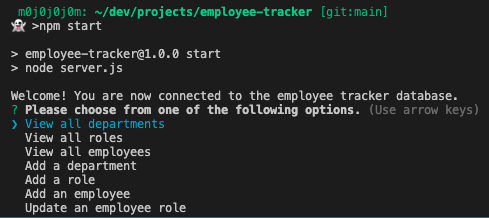

  # Employee Tracker

  ## Description

  A command-line application to manage a company's employee database, using Node.js, Inquirer, and MySQL.

  ## Table of Contents

  * [Installation](#Installation)
  * [Usage](#Usage)
  * [Questions](#Questions)

  ## Installation

  Only need to clone repo to local storage, run "npm install" and initiate with "npm start" on the terminal at the root of the file. If error with connection, go to the connections.js file in the db folder and change the host to "localhost" (MAC computers had a bug that requires the host to be "127.0.0.1" and could not register localhost as host)

  ## Usage

  To create a database that can track employees, roles, and departments within a company. 

  Initiating App: 
  

  Viewing all employees:
  

  Adding a Department:
  

  Walkthrough video:
  https://watch.screencastify.com/v/1iUJwkOYefl5fTee3HCT
  
  ## Contributions

  By: Alex Betancourt
  
  ## Questions

  If you have any questions about the repo, open an issue, or contact me directly at betancourt.alexj@gmail.com. Also, you can find more of my work on github: https://github.com/ajbf92.